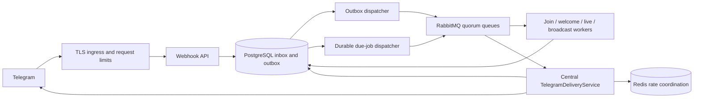

# Telegram automation platform — architecture decision record

Status: historical design baseline, 2026-09-28. The implemented VPS build and its
deliberate limits are described in README.md and operations.md; this proposal is
not an implementation inventory. The current build uses PostgreSQL jobs with
RabbitMQ execution signals rather than the proposed separate outbox relay.
Implementation proceeds through the gates below;
this document is not a claim that all features are implemented or production validated.
The original specification is retained in `requirements.md`.

## 1. System architecture

Java 21, Spring Boot 3.5, PostgreSQL 17, Redis 7.4, RabbitMQ 4.1. One modular
application artifact with independently deployable API, dispatcher, domain-worker,
and sender roles. JDBC with explicit SQL for critical state transitions and batching;
HikariCP bounds connections. No distributed correctness depends on JVM memory.

Webhook: authenticate the secret header, enforce a bounded body, validate envelope,
then commit inbox and outbox together. Return 2xx only after commit (duplicates also
2xx). No Telegram, Redis or RabbitMQ call lies on the webhook acceptance path.
Database unavailability returns a retryable non-2xx. Domain workers persist effects
and follow-up outbox records atomically, then acknowledge RabbitMQ.

## 2. Telegram capability and limitation analysis

Verified against the [official Bot API](https://core.telegram.org/bots/api) on
2026-09-28. It documents secret-header webhooks, join requests and approval,
video-chat service messages, reusable media identifiers, and media-group methods.
Join-request contact via `user_chat_id` lasts five minutes and can end sooner when
processed or another administrator contacts the user. `query_id` join requests have
a separate ten-second response requirement. Video-chat service messages do not
establish universal channel livestream detection. Media groups have method-specific
type and size constraints; not all media methods accept captions or keyboards.

Design consequences: baseline is ordinary admin bots, not guard-bot query mode.
Unknown updates are retained and classified; unsupported queries trigger an alert.
Only observed `video_chat_started` messages initiate automatic live events. Manual
Start Live Notification remains available for other live types. Admins supply both
URLs. No scraping or invented links. Private broadcasts and delayed welcomes require
recorded contact eligibility; channel membership alone is insufficient. Immediate
approval cannot guarantee a subsequent join-request DM, so approval wins and
ineligible welcome jobs are skipped with a recorded reason. `/start` onboarding is
the reliable basis for longer sequences.

The [official FAQ](https://core.telegram.org/bots/faq#broadcasting-to-users)
advises approximately 30 bulk messages/second, one per second per chat and 20/minute
in groups. Treat these as guidance, not a throughput guarantee. Paid broadcasts are
disabled by default.

API methods provide no general client idempotency key for sends. Consequently an
ambiguous network outcome cannot safely be classified as success or retried as if
nothing happened. See section 8.

## 3. Database ER/schema design

All timestamps are `TIMESTAMPTZ`; Telegram IDs are `BIGINT`. UUIDs identify internal
aggregates. `bot_key` is a non-secret installation identifier. Initially one bot per
deployment; keys and uniqueness remain bot-scoped. Tenant context is always the
connected channel. Use composite foreign keys `(channel_id, id)` on child references
to prevent cross-channel linking, and verify membership on every read/write.

| Table | Keys, relationships and important fields |
|---|---|
| telegram_users | `(bot_key, telegram_user_id)` PK; private chat ID, contact eligibility, blocked timestamp |
| channels | UUID PK; unique `(bot_key, telegram_chat_id)`; title, auto_accept, disabled_at, config_version |
| channel_admins | `(channel_id, telegram_user_id)` PK; bot-scoped user FK; OWNER/ADMIN/EDITOR/VIEWER |
| channel_recipients | `(channel_id, telegram_user_id)` PK; user FK, eligibility, joined_at; consent/source |
| join_requests | UUID PK; channel/user FKs; unique `(bot_key, update_id)`; request time, user_chat_id, expiry, status, approval status/time |
| messages | UUID PK; channel FK; content kind, text, entities JSONB, revision; immutable snapshots used by jobs |
| message_media | `(channel_id, message_id, position)` PK; composite message FK; file_id, file_unique_id, type, metadata JSONB |
| inline_buttons | UUID PK; composite message FK; row/column unique per message, label, validated URL |
| welcome_campaigns | UUID PK; channel FK, enabled, revision |
| welcome_steps | UUID PK; composite campaign/message FKs; unique campaign/position; delay_seconds >= 0, enabled |
| welcome_enrollments | UUID PK; channel/user FKs; unique join_request/campaign/revision; immutable sequence snapshot |
| live_settings | channel PK/FK; enabled, message FK, two labels/URLs, config version |
| live_events | UUID PK; channel FK; source, source_event_key, started_at; unique channel/source/key |
| broadcast_campaigns | UUID PK; channel/message FKs; DRAFT/SCHEDULED/RUNNING/PAUSED/CANCELLED/COMPLETED; cursor, audience cutoff, version |
| deliveries | UUID PK; channel FK; immutable payload, chat_id, source, dedupe_key; unique `(bot_key, dedupe_key)`; state, due_at, lease_token, lease_until, result |
| broadcast_recipients | `(campaign_id, user_id)` PK; channel composite FKs; unique delivery_id |
| templates | UUID PK; channel/message FKs; name and revision |
| scheduled_jobs | UUID PK; channel FK; kind, payload, due_at, attempts, lease fields; unique `(bot_key, dedupe_key)` |
| delivery_attempts | `(delivery_id, attempt_no)` PK; lease token, started/finished times, result class, HTTP status, Telegram IDs |
| audit_logs | UUID PK; channel, actor, action, aggregate, time, redacted change metadata |
| update_inbox | `(bot_key, update_id)` PK; bounded original JSONB, received_at, status |
| event_outbox | UUID PK; unique event key; route, payload, due_at, publish attempts, lease fields, published_at |
| consumer_receipts | `(consumer_name, event_id)` PK; processed_at |

Relationships: channel -> admins/recipients/campaigns/messages/live; welcome campaign
-> steps -> message; join -> enrollment -> scheduled jobs -> deliveries -> attempts;
broadcast -> recipients -> deliveries; live -> deliveries. Outbox and receipts bridge
transactions across worker boundaries. This is the final logical model; migrations
are added per tested vertical slice rather than creating unused feature tables now.

Indexes: partial `(due_at,id)` for runnable jobs/outbox, partial `(lease_until,id)`
for leased work, `(channel_id,telegram_user_id)` for audience keyset scans,
`(channel_id,requested_at DESC,id)` for joins, `(campaign_id,state,id)` for progress.
READ COMMITTED plus unique constraints, row locks and compare-and-set transitions.
Workers claim bounded batches with `FOR UPDATE SKIP LOCKED`; transactions never span
Telegram HTTP calls. Keyset pagination requires a stable audience cutoff/cursor.
Pause/cancel is checked at claim and immediately before sending; already in-flight
HTTP requests cannot be revoked. Counters update only on the first terminal transition.

Retention: raw updates expire after a documented privacy window; retain compact
idempotency tombstones for the operational replay horizon. Archive before deleting
audit/attempt history. Partition large histories after measuring actual growth;
partition design must preserve global dedupe keys. Backups require restore drills.

## 4. RabbitMQ topology

Durable direct exchanges `automation.work` and `automation.dead`. Separate durable
quorum queues `join`, `welcome`, `delivery.high`, `delivery.normal`, `delivery.low`,
`live`, `broadcast`, `retry`, with matching routing keys and per-queue DLQs.
Separate sender pools reserve capacity for high-priority traffic. Small bounded
prefetch, explicit/manual acknowledgements, persistent message delivery mode.

Publisher uses mandatory routing and correlated confirms; returned/unconfirmed
messages leave outbox work pending. Confirm-before-mark permits duplicates, never
silent disappearance. Consumers acknowledge only after DB commit. Poison messages
are rejected to DLQ, without automatic infinite requeue. Domain retries use durable
PostgreSQL due times, capped exponential backoff plus jitter and a max attempt count.
The retry queue wakes retry coordinators; it does not use a TTL loop for scheduling.

Queue limits reject new publishes, preserving backpressure in PostgreSQL. Quorum
queues use delivery limit 5, reject-publish overflow and at-least-once dead lettering.
These settings follow [RabbitMQ quorum documentation](https://www.rabbitmq.com/docs/4.1/quorum-queues).
Production requires a three-node broker cluster and tested node-loss recovery;
single-node Compose is local development only.

## 5. Redis strategy

Cache-aside config keyed by bot/channel/version with bounded TTL. Successful DB
configuration transactions emit invalidation events; cache invalidation failure
cannot roll back committed settings. Permission checks and safety-critical toggles
read the DB until version-aware cache validation is implemented. No permission grant
may rely solely on stale cached state.

FSM uses bot/admin/channel-scoped keys with short TTL and validated transitions.
Redis loss cancels incomplete editing sessions with a restart prompt; saved drafts
remain in PostgreSQL. Dedupe cache is advisory. Optional locks use owner tokens and
compare-delete; DB leases/fencing still govern jobs. Atomic Lua uses Redis TIME for
shared rate reservations and cooldowns. Redis unavailable => no external sends;
persist reschedule decisions and recover without losing jobs.

## 6. Idempotency strategy

Webhook PK `(bot_key,update_id)` and inbox/outbox single transaction. Consumers
insert receipts in the same transaction as business effects. Scheduling keys include
join/enrollment/step revision, live event/recipient, or campaign/recipient. Never
dedupe a join forever by channel/user: the same person can legitimately rejoin.
Configuration edits do not silently rewrite already scheduled message snapshots.

Send workers claim delivery with a fencing token. A redelivered queue envelope sees
an existing lease/terminal state and performs no second send. Lease expiry during
external HTTP is uncertain, not permission to immediately send again. DB uniqueness
guarantees internal effects, not exactly-once delivery by an external service.

## 7. Rate-limiting strategy

Conservative configurable defaults: 25 bot messages/sec, broadcast lane capped at
15/sec, one/chat/sec, groups 20/min. Atomic reservation checks all applicable limits
without consuming a partial permit. Album cost is number of messages. High/normal
traffic shares reserved headroom; low traffic cannot consume all global permits.
On denial store the next eligible due time, release the worker, acknowledge after
commit. No sleeping worker pool or busy-wait. Respect `retry_after` using a bot
cooldown persisted in PostgreSQL and mirrored to Redis. Redis restart enters a
conservative warm-up and reloads active cooldowns before delivery resumes.

## 8. Failure and recovery strategy

| Failure | Response |
|---|---|
| DB unavailable at webhook | non-2xx; Telegram can retry; never acknowledge uncommitted work |
| Broker down/full | accept into DB within storage budget; outbox retries with bounded backoff; alert on age |
| Dispatcher crash | lease expiry; republish same event ID; idempotent consumers |
| Worker crash before commit | Rabbit redelivery, receipt/state checks |
| Redis unavailable | fail closed for delivery, durable reschedule; API acceptance stays available |
| Telegram 429 | persist retry_after cooldown, reschedule without sleeping |
| Telegram definite rejection | classify permanent vs retryable; attempts capped; no success counter |
| Timeout/connection reset after request may have left process | UNKNOWN outcome; no automatic resend; operator decides with duplicate warning |
| Crash after successful HTTP before DB commit | stale send attempt becomes UNKNOWN; same reconciliation policy |
| Blocked user | disable private eligibility; fail matching delivery; preserve audit |
| Bot removed/rights revoked | disable channel automation, surface actionable status |
| Invalid file_id | permanent content failure; admin replaces media; no re-download loop |
| Shutdown | stop claiming; bounded drain; unacked envelopes redelivered; reconcile uncertain sends |

Payload bodies, tokens, URLs containing credentials and user content do not enter logs.
Structured logs carry IDs, operation, duration and controlled error category only.
Keep management endpoints private. Metrics cover queues, outbox age, pool usage,
webhook latency, deliveries, errors and unknown outcomes; IDs are not metric labels.
TLS ingress, request-size/rate limits, private infrastructure networks, least-privilege
runtime DB role, separate migration credentials and secret-manager injection are
deployment requirements. Kubernetes needs role deployments, resource budgets,
readiness/liveness, termination grace, NetworkPolicies and disruption budgets.

## 9. Project structure

`com.welcomebot.platform`: `config`, `queue`, `persistence`, `observability` first;
then `telegram.webhook`, `telegram.handlers`, `telegram.keyboards`,
`telegram.delivery`, `admins`, `channels`, `users`, `joinrequests`, `messaging`,
`welcome`, `scheduling`, `live`, `broadcast`, `cache`, `security`, `api` as each
vertical slice is built. Domain state transitions stay outside transport handlers.
`src/test`: unit and real-service Testcontainers integration tests.
`deploy`, `load-tests`, `docs`: operational assets and measured test reports.

## 10. Implementation phases and gates

Each phase must compile, pass unit tests and relevant real-service integration tests
before the next phase begins. A skipped integration test is not a passing gate.

1. Infrastructure: Spring/JDBC/Flyway/Redis/Rabbit, safe queue topology, migrations,
   container setup, metrics and health. Gate: database constraints/migrations,
   Redis restart behavior, confirms/routing/DLQ, application context.
2. Webhook: secret validation, bounded JSON, transactional inbox/outbox, dispatcher.
   Gate: concurrent duplicates, rollback, broker outage, publish/commit crash window.
3. Onboarding: `/start`, channel connect, live Telegram rights checks, role grants.
   Gate: forged callback, cross-channel access, revoked rights and owner transfer.
4. Joins: durable detection, manual/auto approve, status reconciliation.
   Gate: duplicate/rejoin/permission failure, bounded retries, join-query exclusion.
5. Message engine: typed media, immutable content, shared sender, Lua limiter.
   Gate: every media method against HTTP mocks, albums, 429, timeout/unknown.
6. Welcome: CRUD/reorder/duplicate/preview and durable sequence enrollment/jobs.
   Gate: parallel schedulers, restart, edit revision, contact expiry and approval race.
7. Buttons: scoped FSM, rows/order, URL validation (HTTPS/HTTP only, no credentials),
   CRUD and preview. Gate: missing URLs, invalid transitions and stale sessions.
8. Live: official service events plus manual trigger; per-recipient uniqueness.
   Gate: repeated event/manual key, disabled setting, missing URLs, unsupported types.
9. Broadcast: draft/preview/test/confirm/schedule/pause/resume/cancel, keyset fanout.
   Gate: simultaneous campaigns, restart/cursor boundaries, eligibility and counters.
10. Analytics/admin: indexed aggregate jobs, multi-admin management and audit.
    Gate: role matrix, scoped statistics, revoke races and aggregation replay.
11. Hardening: chaos/load/security tests and operational restore drills.
    Gate: 1,000 concurrent joins, 10,000 rapid updates, large multi-channel broadcasts;
    report hardware, p50/p95/p99, throughput, errors, DB load, queue age and backlog.

No measured throughput, production readiness or completed feature is asserted until
its evidence is recorded. The implementation status is tracked separately in README.
